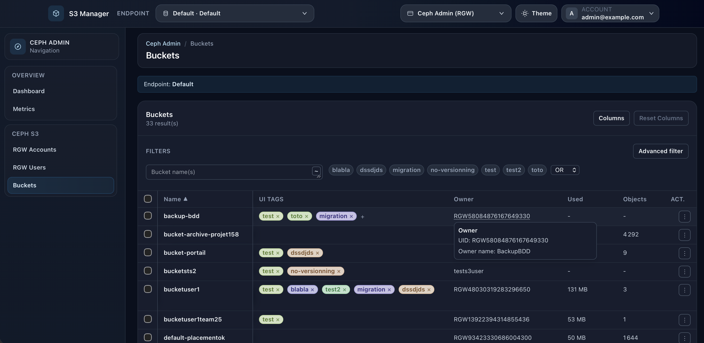

# s3-manager

**s3-manager** is an open-source web application to manage **S3-compatible object storage** (Ceph RGW, AWS S3, MinIO, Scality, ...).

> Project status: **Early-stage / Proof of Concept**. Suitable for labs and validation environments.

## Workspaces

- **Admin**: platform governance, endpoints, users, and settings.
- **Manager**: bucket and IAM administration in account context.
- **Browser**: direct object operations.
- **Portal**: guided self-service workflows.
- **Ceph-admin**: Ceph RGW cluster-wide administration.

## Screenshots

### Admin


### Manager


### Browser


### Ceph-admin



### Portal


## Quick Start (Docker Compose)

Use prebuilt images:

```bash
mkdir s3-manager && cd s3-manager
wget https://raw.githubusercontent.com/ksperis/s3-manager/refs/heads/main/docker-compose.yml
S3_MANAGER_TAG=latest docker compose up
```

Build from source:

```bash
docker compose -f docker-compose.build.yml up --build
```

Default endpoints:

- Frontend: `http://localhost:8080`
- API: `http://localhost:8000/api`

## Full Documentation

See `doc/` (MkDocs) for:

- user workflows
- ops/sysadmin deployment and runbooks
- developer architecture and principles

## License

Apache-2.0 — see `LICENSE`.
