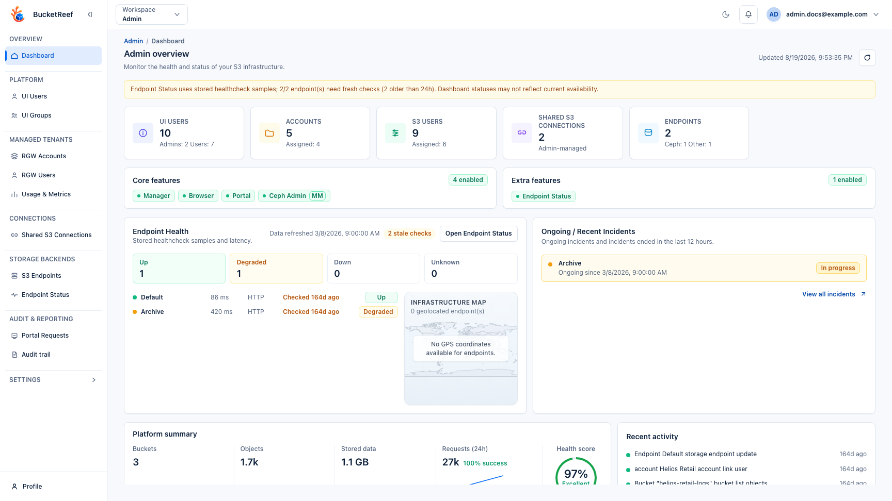
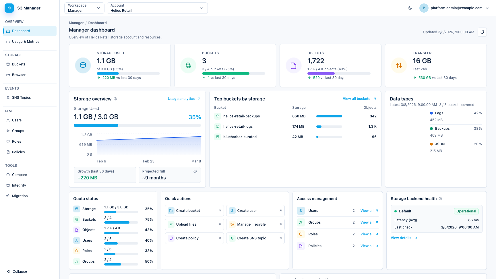
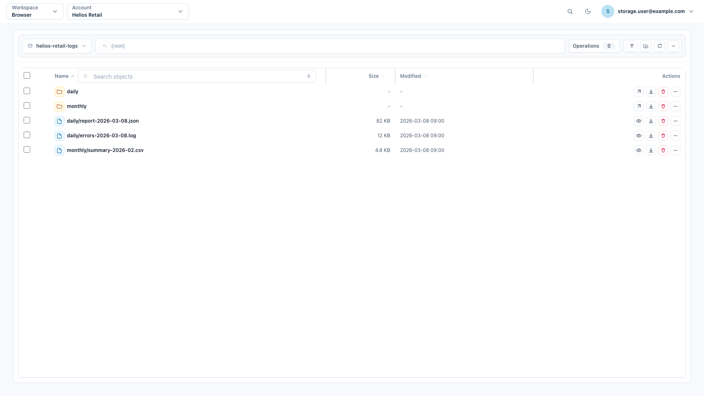
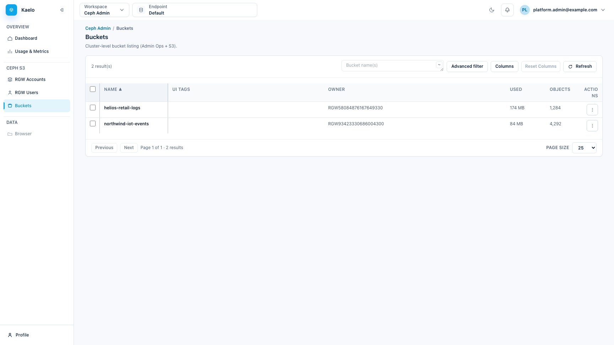
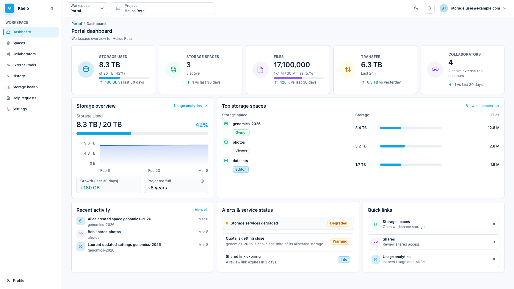

# Kaelo - S3-compatible object storage management

[](https://ksperis.github.io/kaelo/)
[](https://github.com/ksperis/kaelo/tags)
[](./LICENSE)


**Kaelo** is an open-source web application to manage S3-compatible object storage primarily focused on **Ceph RGW**.

> Project status: **Beta**. Suitable for evaluation and controlled deployments.

It gives storage administrators and delegated team managers a single interface to manage their storage environments.
It can also be used solely through the integrated S3 browser for direct object access.


## Workspaces summary

- **Admin**: platform governance, endpoints, users, and settings.
- **Manager**: bucket and IAM administration in account context.
- **Browser**: direct object operations.
- **Portal**: explicit self-service workspace backed by RGW IAM.
- **Ceph-admin**: Ceph RGW cluster-wide administration.

## Workspace features

### Admin

<a href="https://ksperis.github.io/kaelo/user/screenshots-gallery/#admin">
  
</a>

- Manage UI users, roles, and workspace entitlements.
- Administer RGW accounts, S3 users, and S3 connections.
- Register storage endpoints and review endpoint status.
- Access audit trails and platform-wide settings.

### Manager

<a href="https://ksperis.github.io/kaelo/user/screenshots-gallery/#manager">
  
</a>

- Create and configure buckets with versioning, lifecycle, quotas, CORS, and access controls.
- Manage IAM users, groups, roles, policies, and access keys.
- Operate SNS topics when the selected endpoint supports notifications.
- Use migration and comparison tools for bucket alignment and controlled transfers.

### Browser

<a href="https://ksperis.github.io/kaelo/user/screenshots-gallery/#browser">
  
</a>

- Browse buckets, prefixes, and objects from the selected context.
- Upload, download, preview, delete, and restore objects and versions.
- Run bulk operations on large object selections.
- Inspect and update object metadata and tags directly from the UI.

### Ceph-admin

<a href="https://ksperis.github.io/kaelo/user/screenshots-gallery/#ceph-admin">
  
</a>

- Manage Ceph RGW accounts and users at cluster scope.
- Inspect bucket inventory and apply bucket-level configuration centrally.
- Monitor endpoint metrics for operational visibility.
- Run long-running bulk actions with explicit progress and failure counters.

### Portal

<a href="https://ksperis.github.io/kaelo/user/screenshots-gallery/#portal">
  
</a>

- Self-service dashboard for eligible Ceph RGW accounts with IAM enabled.
- Access is explicit per account with `portal_user` or `portal_manager`.
- `/manager` access remains separate and still requires account admin/root links.

## Quick Start (Docker Compose)

Use prebuilt images:

```bash
mkdir kaelo && cd kaelo
wget https://raw.githubusercontent.com/ksperis/kaelo/refs/heads/main/docker-compose.yml
KAELO_TAG=0.2 docker compose up -d
```

`0.2` follows the latest stable patch release in the `0.2.x` line. The stack
also starts the scheduler for healthchecks, billing, quota monitoring, and
usage history.

Default endpoints:

- Frontend: `http://localhost:8080`

## Full Documentation

See the published documentation on GitHub Pages:

- https://ksperis.github.io/kaelo/

## License

Apache-2.0 — see `LICENSE`.
