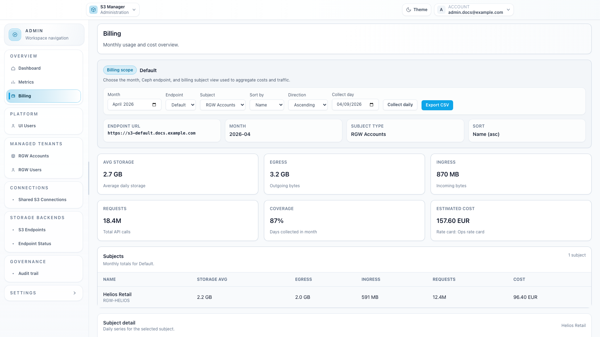
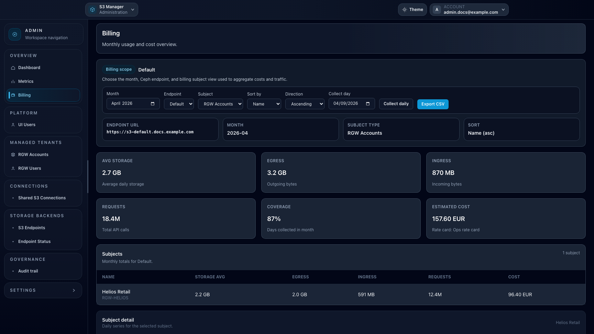

# Feature: Billing in Admin

## When to use

Use this page when you need a monthly usage and estimated cost overview for Ceph-backed tenants.

## Prerequisites

- `ui_admin` or `ui_superadmin` role.
- `billing_enabled=true` in general settings.
- At least one Ceph endpoint with billing data collected for the selected month.

## Steps

1. Open `/admin/billing`.
2. Choose the month, Ceph endpoint, and subject type used for the analysis.
3. Review the summary cards for storage, traffic, request volume, coverage, and estimated cost.
4. Inspect the subjects table to identify the account or user that drives the highest usage.
5. Select a subject row to open daily charts and review storage, traffic, and requests over time.

## Expected result

You can compare monthly billing exposure across tenants and drill into the subjects that explain the current totals.

## Limits / feature flags

!!! note
    Billing analytics are available only when the Billing feature is enabled and billing collection is configured.

## Related pages

- [Workspace: Admin](workspace-admin.md)
- [Ops / Operations: billing](../ops/operations-billing.md)
- [Troubleshooting](troubleshooting.md)

## Visual example

  
  

