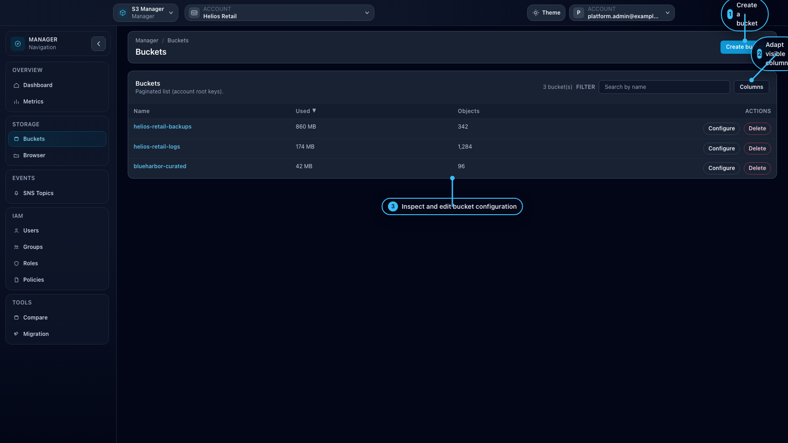

# Feature: Buckets

## When to use

Use this guide when creating, updating, or inspecting bucket configuration.

## Prerequisites

- Access to **Manager** or **Ceph Admin** bucket pages.
- Effective storage permissions on target buckets.

## Steps

1. Open bucket list in Manager (`/manager/buckets`) or Ceph Admin (`/ceph-admin/buckets`).
2. Create or select a bucket.
3. Configure relevant settings based on endpoint support:
   - Versioning
   - Object Lock
   - Lifecycle
   - CORS
   - Policy and ACL options
   - Public access controls
4. Validate changes from bucket detail views.

## Expected result

Bucket configuration is applied as native backend settings and visible in detail pages.

## Limits / feature flags

!!! note
    Exposed controls depend on backend capabilities. Unsupported features are hidden or disabled.

## Related pages

- [Workspace: Manager](workspace-manager.md)
- [Workspace: Ceph Admin](workspace-ceph-admin.md)
- [Feature: Object operations in Browser](feature-objects-browser.md)

## Visual example

