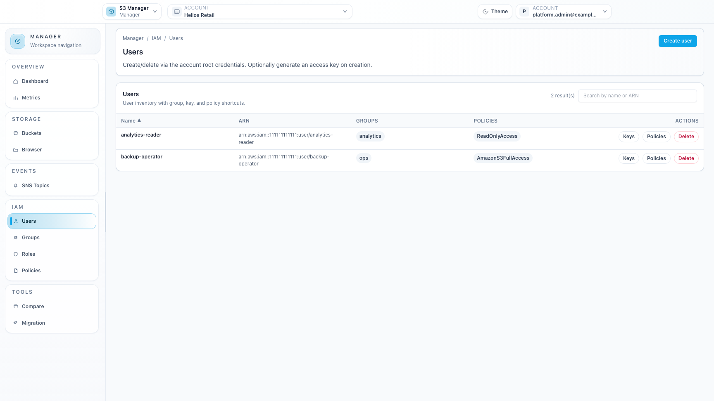
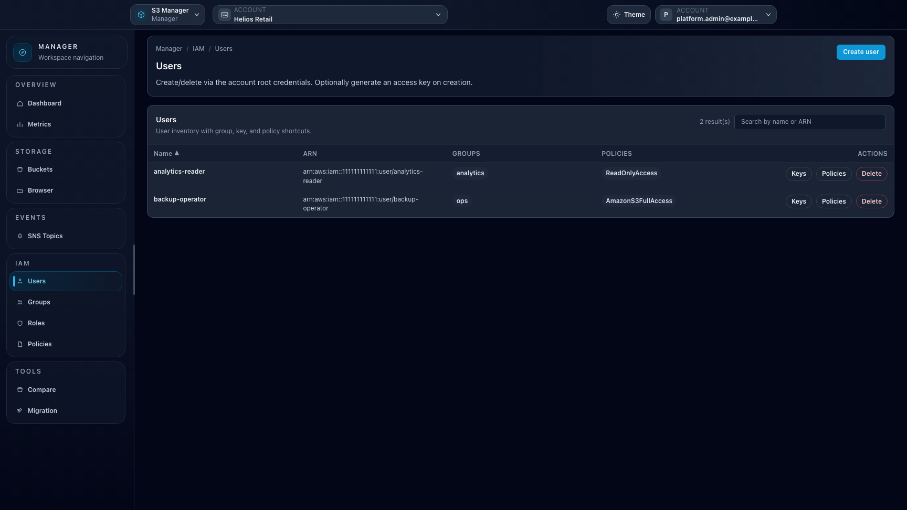

# Feature: IAM

## When to use

Use this guide for tenant IAM administration (users, groups, roles, policies).

## Prerequisites

- Access to Manager IAM pages.
- Endpoint IAM capability enabled.

## Steps

1. Open `/manager/users`, `/manager/groups`, `/manager/roles`, or `/manager/iam/policies`.
2. Create or edit IAM resources.
3. Attach/detach policies to users, groups, or roles.
4. Manage IAM access keys from user key pages.
5. Verify resulting access with your standard IAM validation process.

## Expected result

IAM resources are managed with native IAM semantics.

## Limits / feature flags

!!! note
    IAM UI is unavailable when selected context endpoint reports `iam = false`.

## Related pages

- [Workspace: Manager](workspace-manager.md)
- [Feature: Buckets](feature-buckets.md)

## Visual example

  
  

