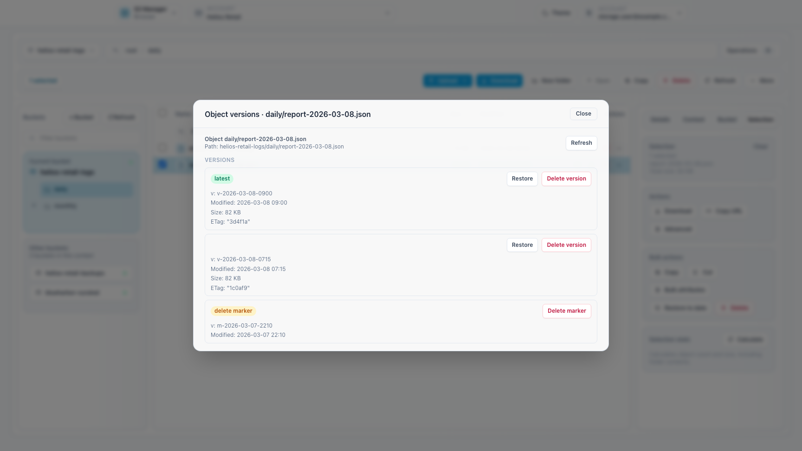
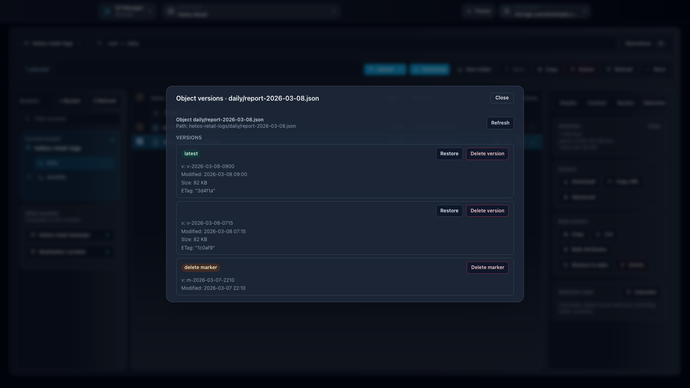

# Feature: Object Versions in Browser

## When to use

Use this guide when you need to inspect object history, restore a previous state, or review delete markers directly from Browser.

## Prerequisites

- Access to `/browser`, `/manager/browser`, or `/ceph-admin/browser`.
- Effective permissions for the target bucket and object.
- Versioning enabled on the bucket.

## Steps

1. Open a Browser surface and navigate to the target bucket and object.
2. Open **Versions** from the item actions.
   - On `/browser`, you can use the item `More actions` menu, the context menu, or version-aware flows triggered from deleted objects.
3. Review the entries shown in the object versions modal.
   - Latest versions and delete markers are clearly identified.
   - Each row keeps restore and delete actions next to the corresponding version metadata.
4. Restore or remove the required version directly from the modal.

## Expected result

You can inspect object history and act on previous versions without leaving Browser.

## Limits / feature flags

!!! note
    Browser availability depends on workspace browser flags and endpoint capabilities. The versions modal is only useful when the target bucket has S3 versioning enabled.

## Related pages

- [Workspace: Browser](workspace-browser.md)
- [Feature: Object operations in Browser](feature-objects-browser.md)
- [Troubleshooting](troubleshooting.md)

## Visual example

  
  

