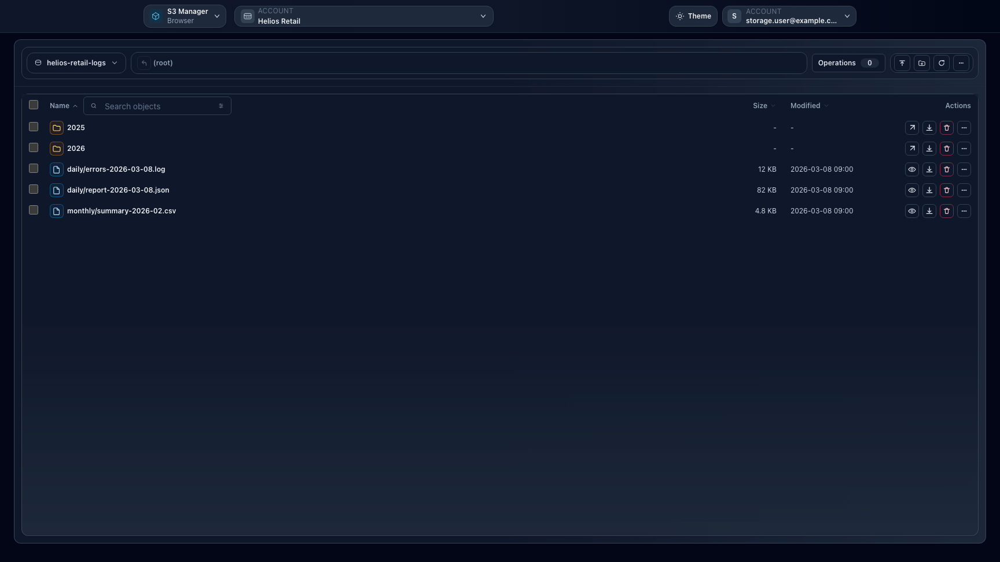

# Feature: Object Operations in Browser

## When to use

Use this guide for object-level actions in Browser surfaces.

## Prerequisites

- Access to `/browser`, `/manager/browser`, or `/ceph-admin/browser`.
- Effective permissions for target bucket/prefix.

## Steps

1. Open a browser surface and choose context/account.
2. Navigate to the target bucket and prefix.
3. Use actions as needed:
   - Use the context menu for the full action set on the current path, object, or selection.
   - Use the toolbar `More` menu when right-click is not available or when the action bar is compact.
   - Use the inspector to access the same context and selection actions on the main `/browser` page.
   - Upload files
   - Download objects
   - Preview supported files
   - Delete objects or delete markers
   - Manage versions, restores, and advanced object operations
4. Use bulk actions when handling many objects.

## Action access

- Path actions include upload, folder creation, paste, versions, restore, cleanup, and copy path.
- Selection actions include download, open, copy URL, copy, cut, bulk attributes, advanced actions, restore, and delete when the current selection allows them.
- The toolbar `More` menu remains available in `/manager/browser` and `/ceph-admin/browser`, where the inspector is not shown.
- Actions can be disabled for the current state. For example, `Copy URL` is disabled when SSE-C is active, and deleted items must be restored from versions before direct download or delete operations.

## Expected result

Object-level operations are executed with current context credentials and reflected immediately.

## Limits / feature flags

!!! note
    Browser availability and operation sets depend on workspace browser flags and endpoint capabilities.

## Related pages

- [Workspace: Browser](workspace-browser.md)
- [Workspace: Manager](workspace-manager.md)
- [Troubleshooting](troubleshooting.md)

## Visual example

