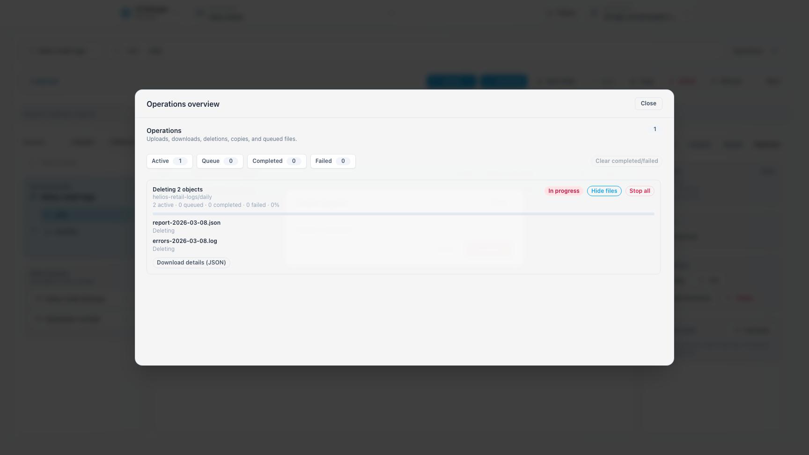
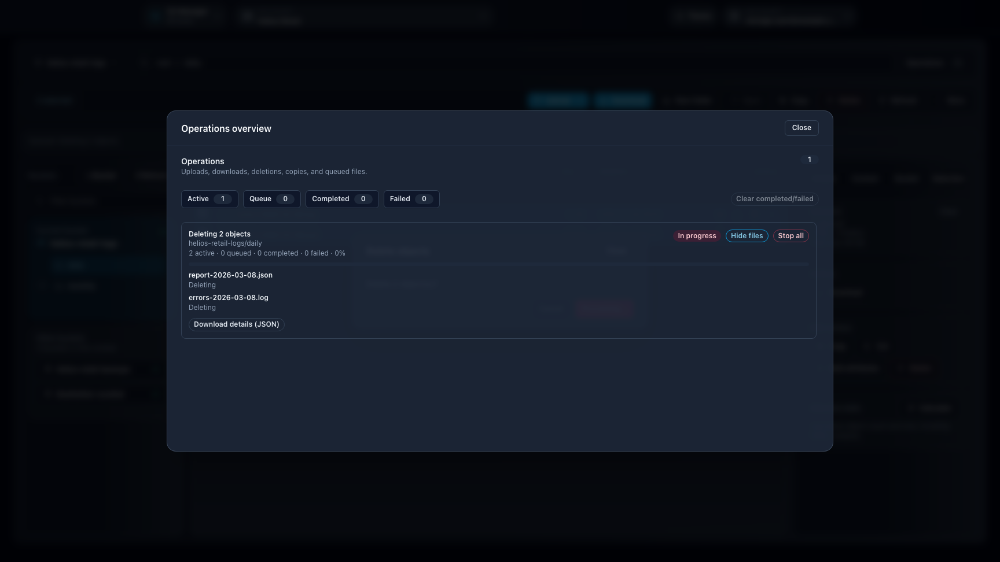

# Feature: Object Operations in Browser

## When to use

Use this guide for object-level actions in Browser surfaces.

## Prerequisites

- Access to `/browser`, `/manager/browser`, or `/ceph-admin/browser`.
- Effective permissions for target bucket/prefix.

## Steps

1. Open a browser surface and choose context/account.
2. Navigate to the target bucket and prefix.
   - On `/browser`, use the left buckets panel to switch bucket directly and inspect folders for the active bucket.
   - Non-active buckets stay collapsed; inaccessible buckets are dimmed until selected.
3. Use actions as needed:
   - Use the context menu for the full action set on the current path, object, or selection.
   - Use the toolbar `More` menu when right-click is not available or when the action bar is compact.
   - Use `More > Columns` to choose which object columns are visible. The default column set stays unchanged until you customize it.
   - Use the inspector to access the same context and selection actions on the main `/browser` page.
   - Upload files
   - Download objects
   - Preview supported files
   - Delete objects or delete markers
   - Manage versions, restores, and advanced object operations
4. Use bulk actions when handling many objects.
5. You can copy or cut items, switch to another Browser execution context, and paste into the target bucket or prefix.
   - Same-context paste keeps the existing storage-side copy path.
   - Cross-context paste is frontend-driven and transfers items one by one.
   - Cross-context move deletes the source only after the destination copy is verified.

## Action access

- Path actions include upload, folder creation, paste, versions, restore, cleanup, and copy path.
- Selection actions include download, open, copy URL, copy, cut, bulk attributes, advanced actions, restore, and delete when the current selection allows them.
- Long-running bulk actions surface in **Operations overview**, where queued, active, completed, and failed work stays visible without leaving Browser.
- The toolbar `More` menu remains available in `/manager/browser` and `/ceph-admin/browser`, where the inspector is not shown.
- Object columns available from `More > Columns` include base listing columns such as `Size`, `Modified`, `Storage class`, and `ETag`, plus lazy detail columns such as `Content-Type`, `Tags`, `Metadata`, `Cache-Control`, `Expires`, and `Restore status`.
- Only base listing columns are sortable. Lazy detail columns are display-only and load on demand for visible rows.
- Actions can be disabled for the current state. For example, `Copy URL` is disabled when SSE-C is active, and deleted items must be restored from versions before direct download or delete operations.

## Expected result

Object-level operations are executed with current context credentials and reflected immediately.

## Limits / feature flags

!!! note
    Browser availability and operation sets depend on workspace browser flags and endpoint capabilities.

## Related pages

- [Workspace: Browser](workspace-browser.md)
- [Workspace: Manager](workspace-manager.md)
- [Feature: Object versions in Browser](feature-object-versions-browser.md)
- [Troubleshooting](troubleshooting.md)

## Visual example

  
  

