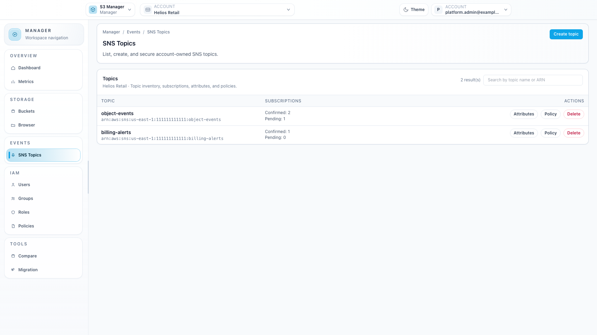
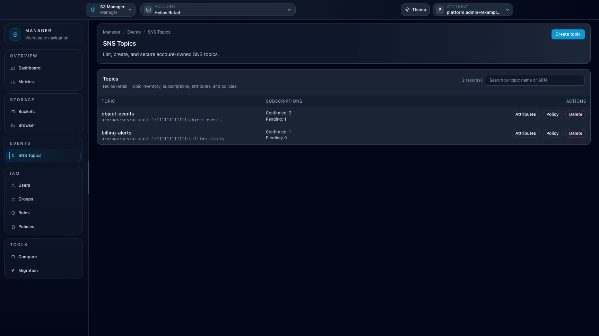

# Feature: SNS Topics

## When to use

Use this guide to manage SNS topic resources from Manager.

## Prerequisites

- Access to `/manager/topics`.
- Endpoint SNS capability enabled.

## Steps

1. Open **Manager > SNS Topics**.
2. Create a topic.
3. Inspect topic attributes.
4. Edit or review topic policy.
5. Delete unused topics.

## Expected result

SNS topics are managed within the selected manager context.

## Limits / feature flags

!!! note
    SNS menu is shown only when endpoint capability `sns` is enabled.

## Related pages

- [Workspace: Manager](workspace-manager.md)

## Visual example

  
  

