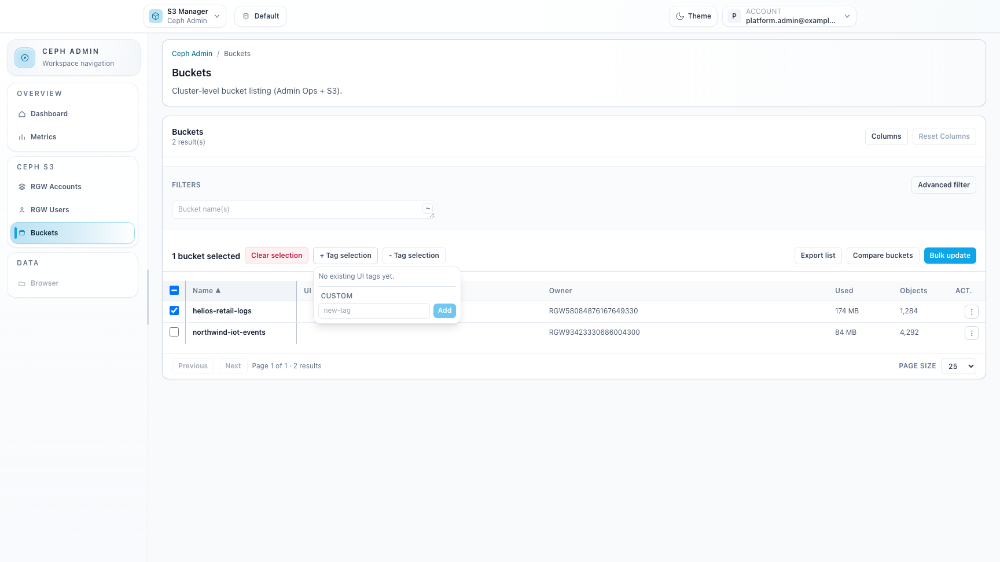
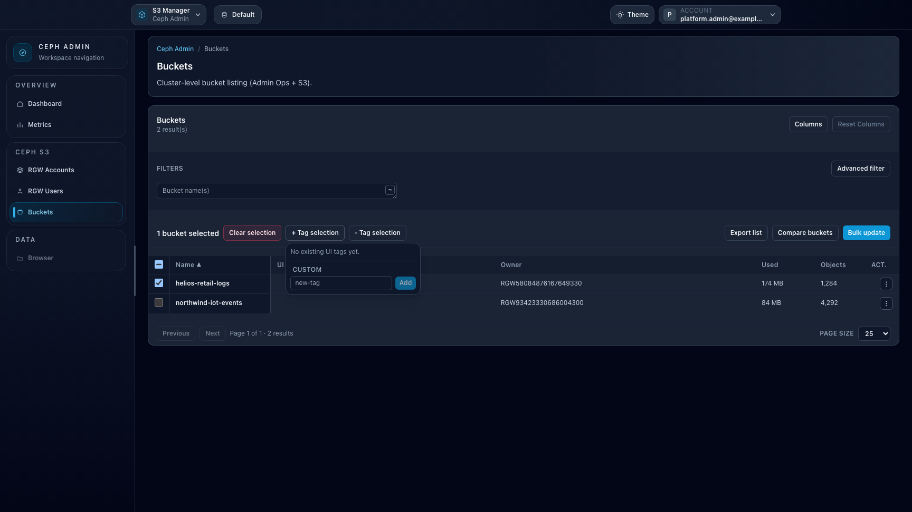

# How-to: Use UI tags in Ceph Admin

## When to use

Use **UI tags** in **Ceph Admin > Buckets** to organize working sets for investigations, cleanups, migrations, or operations campaigns.

## Prerequisites

- Access to `/ceph-admin/buckets`.
- An endpoint selected in Ceph Admin.

## Steps

1. Open **Ceph Admin > Buckets**.
2. Select one or more buckets in the table.
3. Use **+ Tag selection** to apply tags:
   - Pick an existing suggestion, or
   - Add a custom tag with the `new-tag` input.
4. Use **- Tag selection** to remove tags from the current selection.
5. Reuse UI tags to filter and manage recurring operational groups.

## Expected result

Selected buckets receive UI tags that can be reused to speed up repeated operational workflows.

## Limits / feature flags

!!! note
    UI tags are console-side organizational metadata and do not modify backend bucket tags unless you explicitly update S3 tags separately.

## Related pages

- [Workspace: Ceph Admin](workspace-ceph-admin.md)
- [How-to: Use Advanced Filter in Ceph Admin](howto-ceph-advanced-filter.md)

## Visual example

  
  

