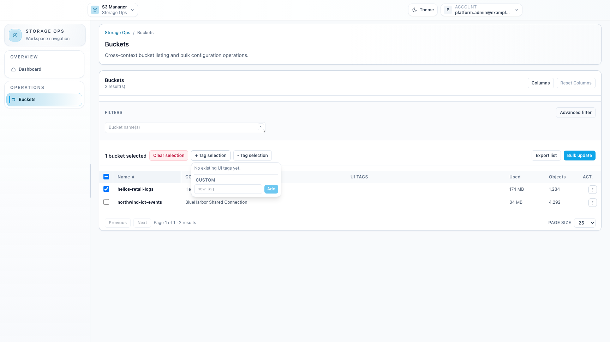
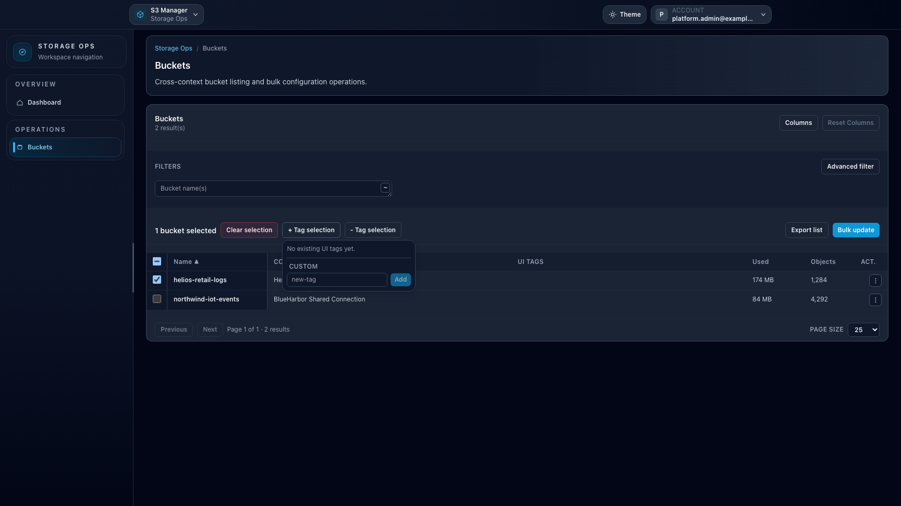

# How-to: Use UI tags in Storage Ops

## When to use

Use **UI tags** in **Storage Ops > Buckets** to build reusable operational selections across multiple contexts.

## Prerequisites

- Access to `/storage-ops/buckets`.
- `storage_ops_enabled` feature enabled.

## Steps

1. Open **Storage Ops > Buckets**.
2. Select one or more buckets.
3. Use **+ Tag selection** to assign tags:
   - choose an existing tag, or
   - create a new tag with the `new-tag` input.
4. Use **- Tag selection** to remove tags from the selected rows.
5. Use tag filters to quickly restore the same selection scope later.

## Expected result

Your selected buckets are grouped with UI tags so repeated operational campaigns are faster to run.

## Limits / feature flags

!!! note
    UI tags are stored in browser localStorage and do not modify backend S3 tags. Storage Ops and Ceph Admin share the same root storage key with isolated namespaces.

## Related pages

- [Workspace: Storage Ops](workspace-storage-ops.md)
- [How-to: Use UI tags in Ceph Admin](howto-ceph-ui-tags.md)

## Visual example

  
  

