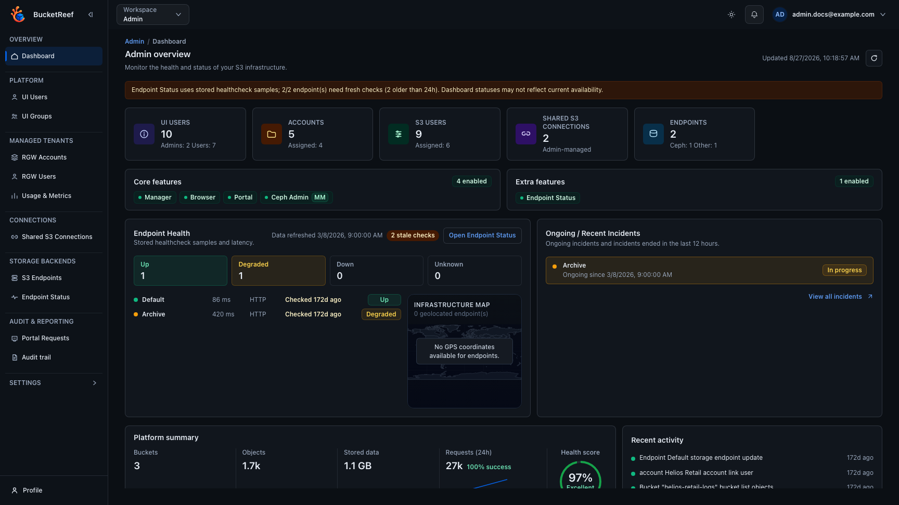

# User Guide

This guide is for people using the UI daily.

- **Storage administrator**: platform admin, tenant admin, or Ceph admin.
- **Storage user**: object operations and limited self-service.

Use this section for task-oriented instructions. Each page focuses on actionable steps and expected outcomes.

## Recommended reading order

1. [Start here](start-here.md)
2. [Common tasks for storage users](common-tasks-storage-user.md) or [common tasks for storage administrators](common-tasks-storage-admin.md)
3. [Storage admin runbook](admin-runbook-storage-admin.md) when you need to prepare a team handover.
4. [User profile](profile.md)
5. [Glossary and search tips](glossary.md) when a term is unclear.
6. Workspace pages (`Admin`, `Manager`, `Portal`, `Browser`, then optional `Ceph Admin` and `Storage Ops`)
7. Feature pages for the exact action you need.

## Choose your path

| If you are... | Read next | Good first outcome |
|---|---|---|
| A storage user | [Common tasks for storage users](common-tasks-storage-user.md) | You know where to browse files, manage simple access, and report missing permissions. |
| A storage administrator | [Storage admin runbook](admin-runbook-storage-admin.md) | You can configure the first endpoint, context, workspace, validation, and handover evidence. |
| A Portal user | [Workspace: Portal](workspace-portal.md) | You understand Storage Spaces, files, sharing, usage, and access keys. |
| A Browser user | [Workspace: Browser](workspace-browser.md) | You can select the right context and act on objects safely. |

## Search help

Use [Glossary and search tips](glossary.md) when you are not sure whether the product calls something a file, object, bucket, Storage Space, context, endpoint, access key, or connection.

## Visual example

  
  

