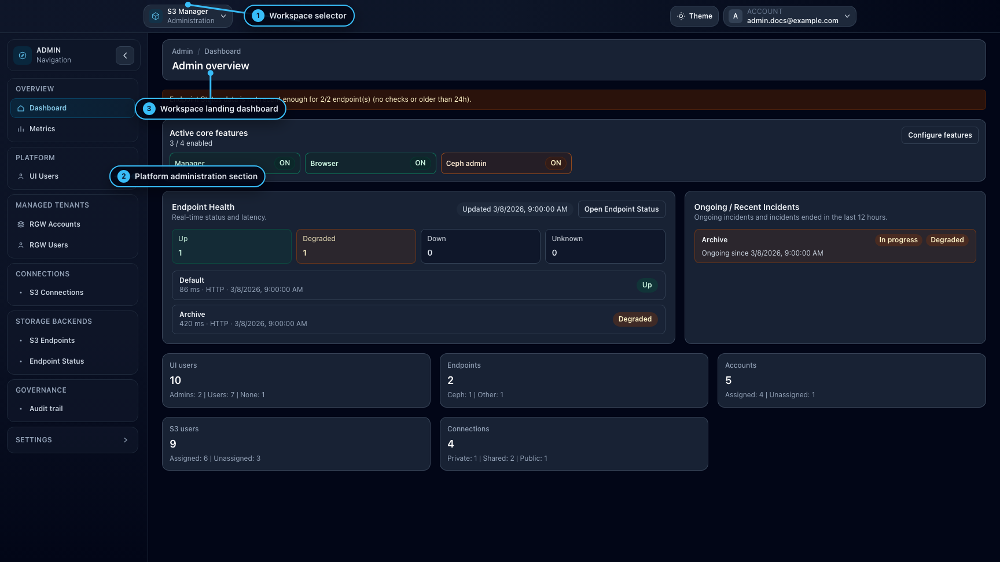

# User Profile and Private S3 Connections

## When to use

Use this page when you need to adjust personal UI preferences or manage your own private S3 connections.

## Prerequisites

- You can sign in to the UI.
- For private S3 connections, your role or instance settings must allow them.

## Steps

1. Open `/profile`.
2. In **Preferences**:
   - choose language and theme,
   - set the default workspace after sign-in,
   - enable **Show tags in top selectors** if you want compact color-coded tags in the topbar context and endpoint selectors on this browser.
3. In **Private S3 connections**:
   - create or edit your own private connection,
   - use the dedicated **Tags** tab to add or recolor tags from your private tag catalog,
   - search by name, endpoint, provider, or tag,
   - enable or disable access for `Manager` and `Browser`.

## Expected result

Your local UI preferences are updated, and your private connections remain easier to identify and filter.

## Limits / feature flags

!!! note
    The selector-tags preference is stored locally in the browser. It is not shared across browsers or devices.

!!! note
    Private S3 connections remain private to their owner. Tags on those connections are also editable only by the owner.

!!! note
    Tag colors are shared per tag inside your own private-connections catalog. Recoloring a private tag updates the same tag everywhere in your private connection inventory.

## Related pages

- [Start here](start-here.md)
- [Workspace: Manager](workspace-manager.md)
- [Workspace: Browser](workspace-browser.md)

## Visual example

