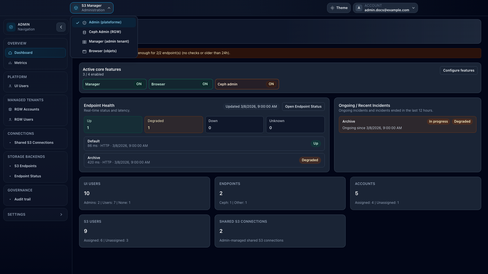

# Start Here

## When to use

Use this page when you log in for the first time and need to understand where to work.

## Prerequisites

- You can sign in to the UI.
- Your account has at least one workspace enabled.

## Steps

1. Sign in and let the UI redirect you to your default workspace.
2. Confirm available workspaces in the top workspace selector.
3. Pick the workspace matching your task:
   - `Admin`: platform setup and governance.
   - `Manager`: bucket and IAM administration.
   - `Browser`: object operations.
   - `Ceph Admin`: Ceph cluster-level tasks.
   - `Storage Ops`: cross-context bucket operations.
4. If you see context or endpoint selectors, select the right account or endpoint before acting.
5. If compact selector tags help your workflow, enable **Show tags in top selectors** from [User profile](profile.md) to display color-coded tags directly in the top selectors.

## Expected result

You know which workspace to use and can start from the correct context.

## Limits / feature flags

!!! note
    Workspace visibility depends on role, account links, and feature flags (`manager_enabled`, `browser_enabled`, `ceph_admin_enabled`, `storage_ops_enabled`).

## Related pages

- [Use cases for storage administrators](use-cases-storage-admin.md)
- [Use cases for storage users](use-cases-storage-user.md)
- [User profile](profile.md)
- [Troubleshooting](troubleshooting.md)

## Visual example

