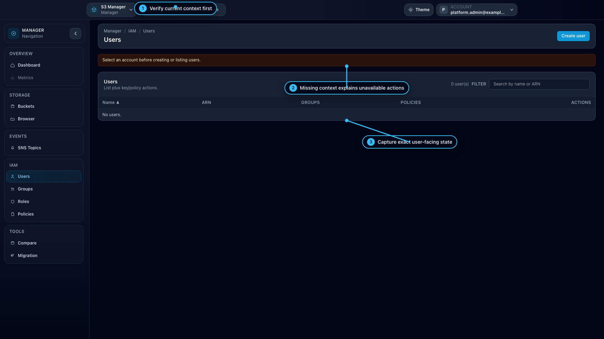

# Troubleshooting

## When to use

Use this page when a user action fails or an expected menu/page is missing.

## Prerequisites

- Access to your current workspace.
- Ability to report route, context, and error message.

## Steps

1. Verify workspace and context selectors (account/endpoint).
2. Check whether feature is enabled globally (Admin settings).
3. Confirm endpoint capability for the selected context (IAM, browser, sns, metrics).
4. Retry and capture exact error text.
5. If needed, ask ops/admin to check audit trail and backend logs.

## Expected result

You can identify whether the issue is permission, feature flag, endpoint capability, or operational failure.

## Limits / feature flags

!!! note
    `AccessDenied` from backend is expected behavior when IAM/S3 denies the action.

## Related pages

- [Workspace: Admin](workspace-admin.md)
- [Workspace: Manager](workspace-manager.md)
- [Ops / Observability](../ops/operations-observability.md)

## Visual example

