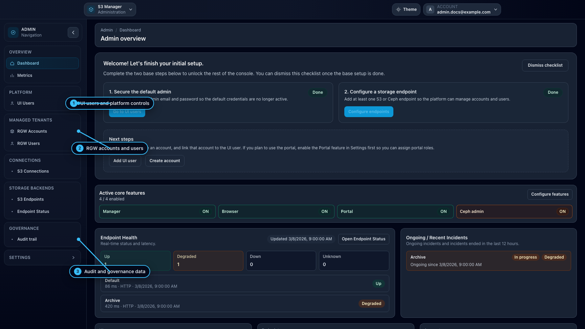

# Workspace: Admin

## When to use

Use **Admin** for platform governance and global configuration.

## Prerequisites

- `ui_admin` or `ui_superadmin` role.

## Steps

1. Open `/admin`.
2. Use **Platform** to manage UI users.
3. Use **Managed Tenants** to manage RGW accounts and users.
4. Use **Connections** for S3 connections.
5. Use **Storage Backends** for endpoints and endpoint status.
6. Use **Governance** for audit trail.
7. If superadmin, use **Settings** pages for global behavior.

## Expected result

Platform and tenant-entry resources are configured and auditable.

## Limits / feature flags

!!! note
    Billing, Endpoint Status, and some browser settings are visible only when corresponding features are enabled.

!!! note
    UI User role and entitlement rules:

    - `ui_none`: no workspace access (profile remains accessible).
    - `ui_user`: non-admin workspaces only.
    - `ui_admin`: user-level workspace access plus `/admin`.
    - `ui_superadmin`: admin access plus `/admin/*-settings`.
    - `ui_superadmin` role assignment/promotion is restricted to superadmin users.
    - `can_access_ceph_admin` can be granted only by superadmin users, and only for `ui_admin` or `ui_superadmin`.
    - `can_access_storage_ops` can be granted by `ui_admin` or `ui_superadmin` for `ui_user`, `ui_admin`, or `ui_superadmin`.
    - Entitlements are automatically disabled when the target role does not support them.

## Related pages

- [Workspace: Manager](workspace-manager.md)
- [Ops / Configuration](../ops/configuration.md)
- [Ops / Security](../ops/operations-security.md)

## Visual example

