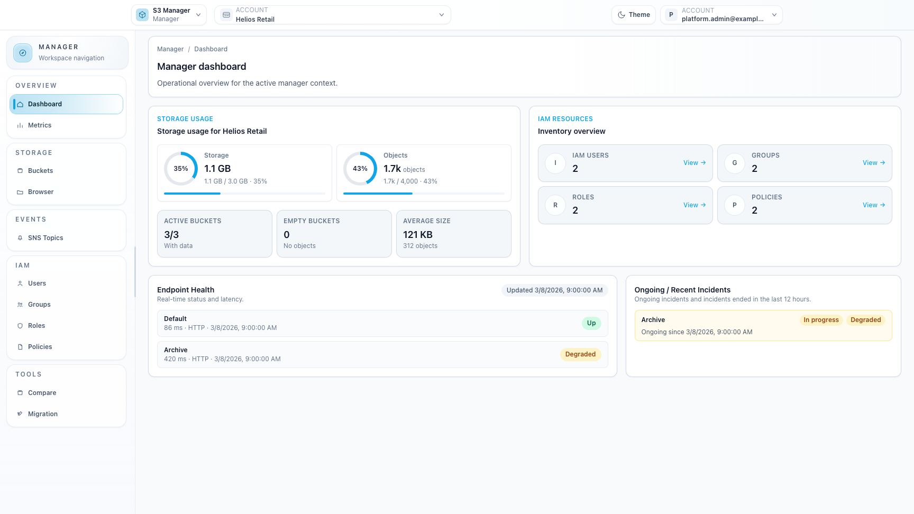
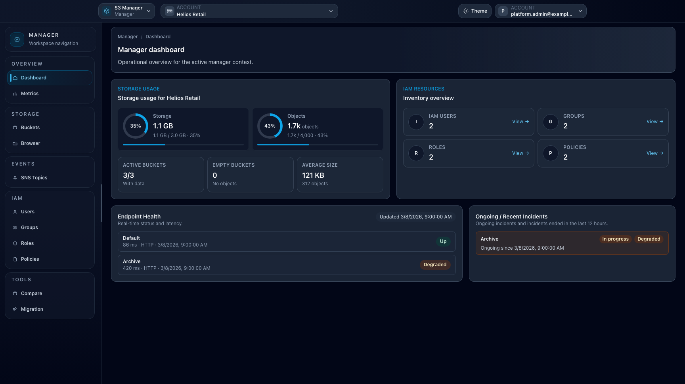

# Workspace: Manager

## When to use

Use **Manager** for account-scoped administration aligned with S3/IAM semantics.

## Prerequisites

- Access to `/manager`.
- A valid execution context selected (`ctx` or default context).

## Steps

1. Open `/manager` and select the correct account/context.
   - If you enabled **Show tags in top selectors** from [User profile](profile.md), compact color-coded `Standard` account and endpoint tags are shown directly in the selector. `Administrative` tags remain limited to management surfaces.
2. Use **Storage** for buckets and manager browser (if enabled).
3. Use **IAM** for users, groups, roles, and policies (if IAM capability is available).
4. Use **Events** for SNS topics (if endpoint supports SNS).
5. Use **Tools** for:
   - Bucket Compare (if enabled)
   - Bucket Migration (if enabled and authorized)

## Expected result

Tenant resources are managed in the right scope with explicit context control.

## Limits / feature flags

!!! note
    IAM pages depend on endpoint IAM capability. Tools depend on `bucket_compare_enabled`, `bucket_migration_enabled`, and role-based permissions.

## Related pages

- [Feature: Buckets](feature-buckets.md)
- [User profile](profile.md)
- [How-to: Configure a bucket from Manager](howto-manager-bucket-configuration.md)
- [Feature: IAM](feature-iam.md)
- [Feature: SNS topics](feature-topics.md)
- [Feature: Bucket compare](feature-bucket-compare.md)
- [Feature: Bucket migration](feature-bucket-migration.md)

## Visual example

  
  

