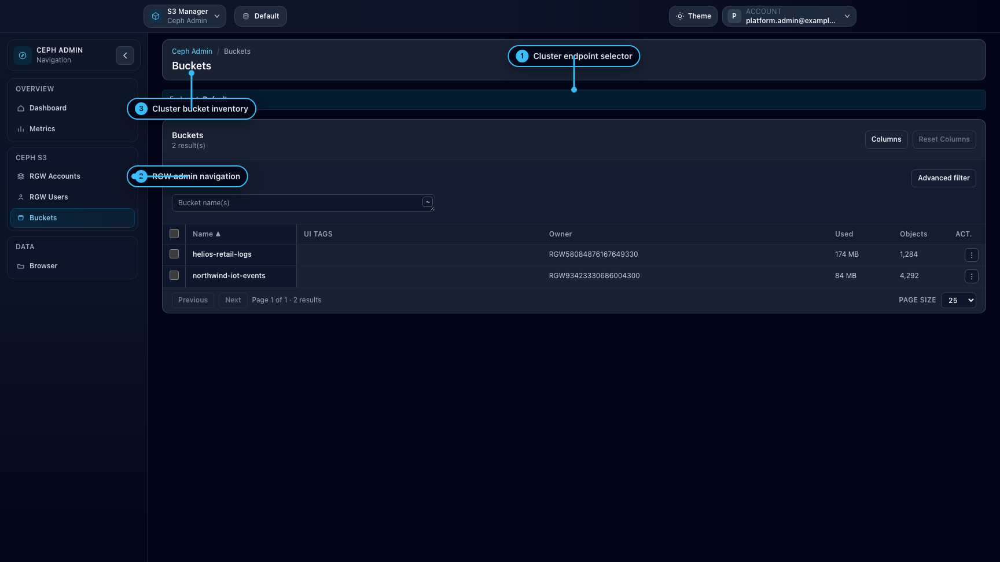

# Workspace: Storage Ops

## When to use

Use **Storage Ops** for cross-context bucket operations on S3-compatible backends, outside Ceph-only administration.

## Prerequisites

- Admin-like UI role.
- `storage_ops_enabled` feature enabled.
- At least one authorized manager context (`account` or `connection`).

## Steps

1. Open `/storage-ops`.
2. Go to **Buckets**.
3. Use the same workbench patterns as Ceph Admin Buckets:
   - quick search,
   - advanced filter,
   - dynamic columns,
   - bulk preview/apply,
   - export.
4. Use **Context** and **Kind** columns to distinguish identical bucket names across contexts.

## Expected result

You can search and operate on large bucket sets across authorized accounts and connections from one operational surface.

## Limits / feature flags

!!! note
    In v1, Storage Ops aggregates `account` and `connection` contexts only. UI tags are local browser metadata (localStorage), namespaced separately from Ceph Admin.

## Related pages

- [Use cases for storage administrators](use-cases-storage-admin.md)
- [Workspace: Ceph Admin](workspace-ceph-admin.md)
- [How-to: Use UI tags in Storage Ops](howto-storage-ops-ui-tags.md)
- [How-to: Use Advanced Filter in Ceph Admin](howto-ceph-advanced-filter.md)

## Visual example

